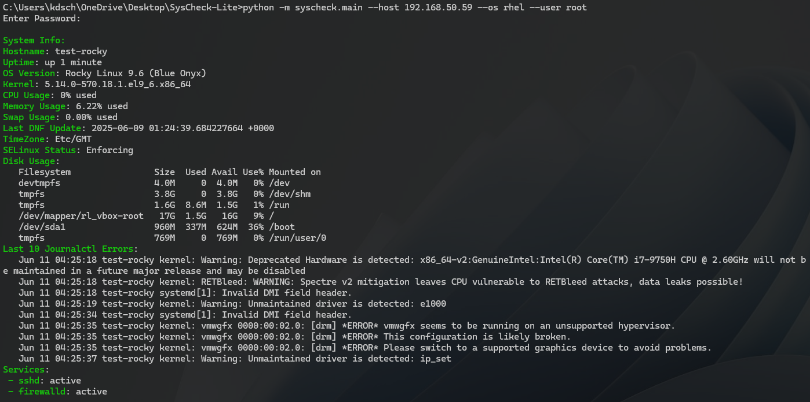
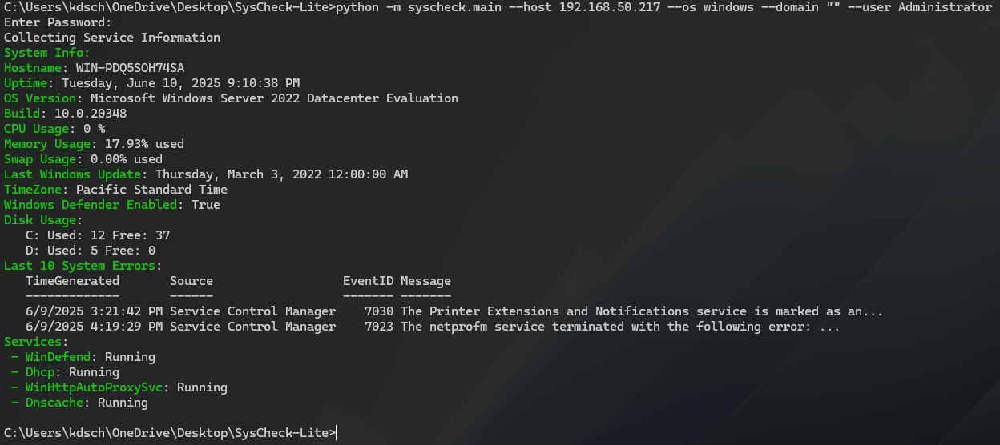
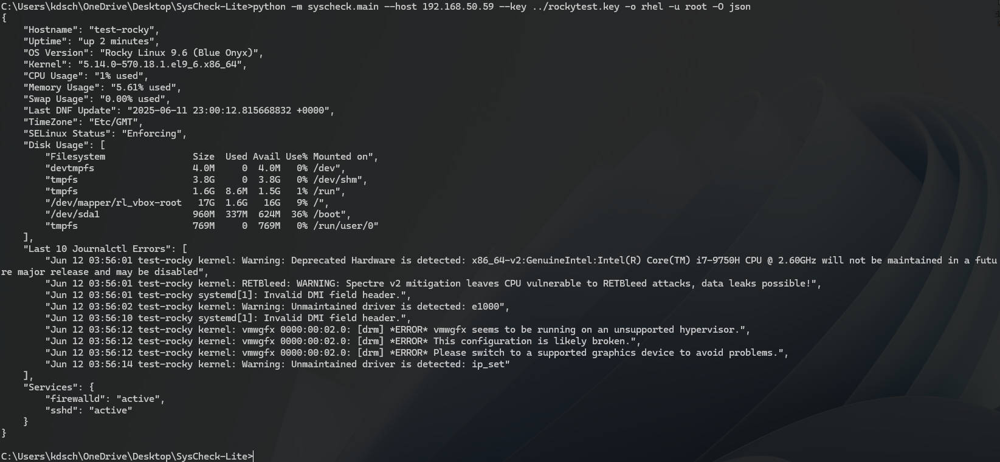
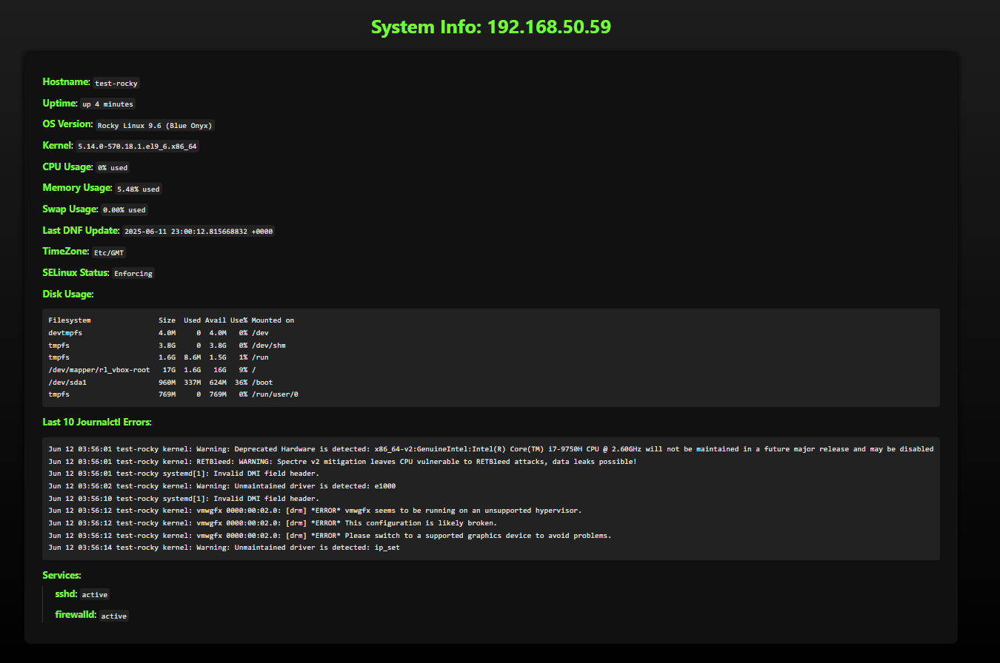
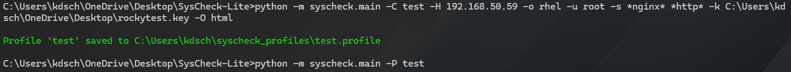
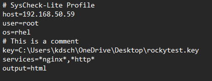

<p align="center">

  
  
  
  
</p>

# SysCheck-Lite
SysCheck-Lite is a lightweight CLI utility designed to provide a quick, high-level snapshot of a system's health. It is ideal for manual use at the beginning of a troubleshooting session, giving you instant access to basic but essential information such as compute resources, memory, disk status, services, errors, OS details, and pending updates.

## Table of Contents
- [Philosophy](#philosophy)
- [Installation (Development)](#installation-development)
- [Features](#features)
- [Arguments](#arguments)
- [Example Commands](#example-commands)
- [Example Outputs](#example-outputs)
- [Working with Profiles](#working-with-profiles)
- [Contributing](#contributing)
- [License](#license)

## Philosophy
SysCheck-Lite is intentionally lightweight by design. Its purpose is to provide a quick, high-level overview of a system’s health without requiring the setup, configuration, or ongoing maintenance typical of full-scale monitoring platforms.

Rather than acting as a persistent agent or metrics aggregator like Nagios, Prometheus, or Zabbix, SysCheck-Lite is a manually-invoked diagnostic utility meant for rapid assessment at the start of troubleshooting. It captures the most commonly referenced system details — CPU, memory, disk usage, OS info, service states, and updates — in a single, accessible snapshot.

This tool is ideal for:

- System administrators, engineers, and technicians who want to get their bearings quickly before digging deeper.

- Environments with minimal tooling where manual assessments are common.

- Jumpbox or break-glass scenarios where a fast, no-dependency script is more appropriate than agent-based telemetry.

To maintain its simplicity and ease of use, SysCheck-Lite avoids:

- Background daemons or services

- Continuous logging or metrics collection

- Complex alerting rules

- Long-term data retention or dashboards

Scope Creep Disclaimer: Any features that conflict with the tool’s mission of staying minimal and user-triggered by design will not be accepted into the project. Simplicity, speed, and clarity are the priorities.

## Installation (Development)
Clone the repository and run the module directly:

``` bash
git clone https://github.com/KDScheuer/SysCheck-Lite.git
cd SysCheck-Lite
python -m syscheck.main --host 192.168.50.59 ...
```
> **Note:** SysCheck-Lite will eventually be available via `pip install syscheck-lite`. Until then, use the development install instructions above.


## Features
- Supports both Linux and Windows
- Outputs to Terminal, JSON, or HTML
- SSH key-based or password authentication
- Lightweight, minimal dependencies
- Interactive prompts or CLI argument support

## Arguments
All Arguments are optional, if none are provided you will be prompted for them interactively.
- ⚠️ Avoid using --password directly in the terminal, as it will display your password in plain text. For better security, either omit it to be prompted interactively or use an environment variable to store the password securely. 
- When passing --domain "" explicitly, no domain prompt will appear.

| Argument       | Description                                                                 |
|----------------|-----------------------------------------------------------------------------|
| `-H`, `--host`       | Target machine IP address or DNS name                                            |
| `-u`, `--user`       | Username to authenticate with                                                    |
| `-o`, `--os`         | Target machine OS (`windows`, `rhel`, `debian`, `ubuntu`)                        |
| `-k`, `--key`        | SSH private key file path for passwordless authentication. This is only used if the target host is a linux based system.                       |
| `-s`, `--services`   | List of services to query (supports wildcards, e.g., `*sql*`, `http*`)           |
| `-d`, `--domain`     | Domain name for authentication. If provided, it will be combined as `DOMAIN\username`. If you prefer to use `username@domain.com`, leave this blank and enter the full username instead.                                |
| `-h`, `--help`       | Display Help                                                                     |
| `--version`          | Display the current version of SysCheck-Lite                                     |
| `-O`, `--output`      | Choices for program output (`terminal (default)`,`json`,`html`)                  |
| `-p`, `--password`    | Password to use for authentication. Optional will prompt securely if not provided | 
| `-P`, `--profile`    | Load a saved profile with connection settings. CLI Input will take priority over the values in the profile. | 
| `-C`, `--createprofile`    | Save arguments into profile for use later.| 

## Example Commands
Connecting to Linux host using ssh key and displaying webpage with the results
``` bash
syscheck.main -H testapp01 -o rhel -u root -k ../../rockytest.key -O html
```

Connecting to Linux host with an interactive password prompt
``` bash
syscheck.main -H 192.168.50.59 -o rhel -u root
```

Connecting to Windows host with JSON output and all other required arguments as an interactive prompt
```bash
syscheck.main -H wintestapp01 -O json
```

Connecting to host with all interactive prompts and querying services
```bash
syscheck.main -s *sql* *httpd* *nginx* *php*
```

Creating / Loading a profile
```bash
python -m syscheck.main -C test -H 192.168.50.59 -o rhel -u root -s *nginx* *http* -k C:\Users\kdsch\OneDrive\Desktop\rockytest.key -O html
```
```bash
python -m syscheck.main -P test
```
See [Working with Profiles](#working-with-profiles) for more information


## Example Outputs
### Terminal Output Examples
Linux System


Windows System


### JSON Output Example


### HTML Output Example


## Working with Profiles
Profiles can be used to save the connection settings, then later loaded to provide values for the required arguments. Profiles are stored in the users home directory in key value format, and support comments. If a value is passed at runtime it will override any value in the profile.

### Example Profile Usage


### Example Profile File Contents


## Contributing
Contributions are welcome for bug fixes or simple improvements that align with the project’s goal of remaining lightweight. Please open an issue or submit a pull request for discussion.

## License
This project is licensed under the MIT License. See the [LICENSE](./LICENSE) file for details.